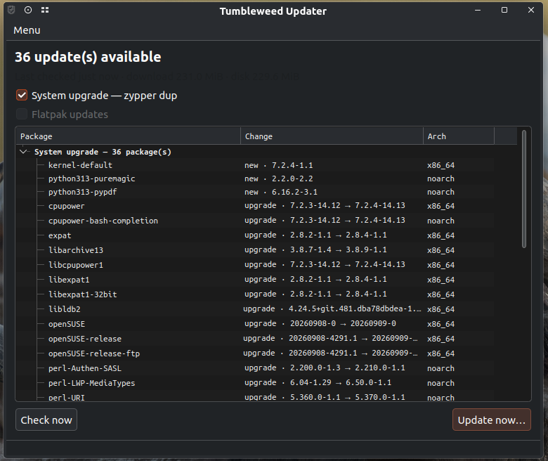
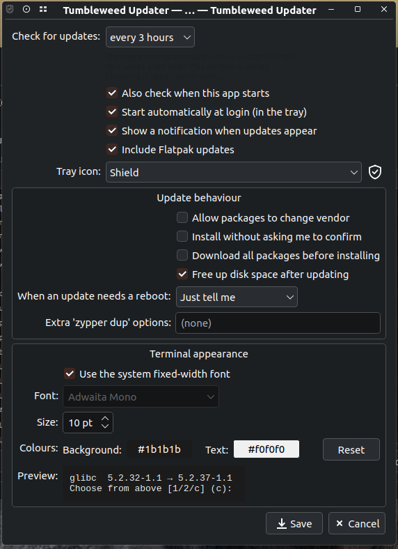
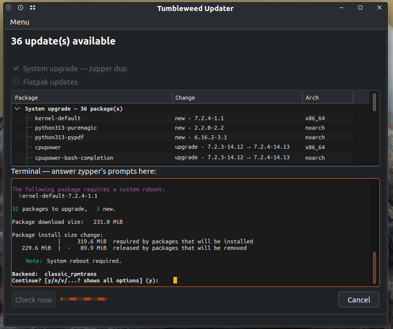

# Tumbleweed Updater

A system-tray update manager for openSUSE Tumbleweed on KDE Plasma.

Features:

1. Lives in the system tray. The icon follows the Plasma light/dark theme while
   the system is up to date and turns openSUSE orange when updates are waiting.
2. Shows a window listing the pending `zypper dup` and Flatpak updates.
3. Runs the upgrade in an embedded terminal, so you answer `zypper`'s prompts
   (the resolver's "Choose from above solutions", vendor changes, and so on) as
   if you had run `zypper dup` yourself.
4. Takes Btrfs snapshots through `zypper` itself via `snapper-zypp-plugin`, the
   same pre/post snapshots a manual `sudo zypper dup` produces. The app warns if
   that plugin is missing.
5. Checks for updates in the background with a systemd timer. The cadence
   (hourly to weekly, or manual) is set from the app's settings.
6. Lets you browse the Btrfs snapshots snapper has taken, see what changed
   in a pre/post pair, roll back to one, or delete one (Menu → Snapshots…).
7. Returns to a clean state once an update is done. Closing the window to the
   tray clears the terminal and collapses it, so the next time you open the
   window you are not still looking at the last update's output. When that
   happens is configurable in the settings, and you can clear the log yourself
   at any time with the "Hide log" button or the terminal's right-click menu.

## Screenshots

1. The update list, showing pending `zypper dup` and Flatpak updates with
   the version change and architecture for each package.

   

2. Settings: check interval, update behaviour, tray icon style and terminal
   appearance.

   

3. The embedded terminal running `zypper dup`, where you answer its prompts
   directly.

   

## Requirements

`python3-pyside6`, `python3-pyte`, `zypper`, `polkit` (with a polkit agent such
as `polkit-kde-agent-6`), optionally `flatpak`, and `snapper-zypp-plugin` for
snapshots. The RPM installed below declares all of these, so `zypper` pulls
them in automatically.

## Install

```sh
sudo zypper addrepo -f \
  https://barniclebazil.github.io/tumbleweed-updater/tumbleweed-updater.repo
sudo zypper install tumbleweed-updater
```

Once installed, the app starts automatically and its background-check timer
is enabled. You'll find it in the system tray from then on.

## Run

```sh
tumbleweed-updater          # open the window
tumbleweed-updater --tray   # start hidden in the tray (used for autostart)
```
